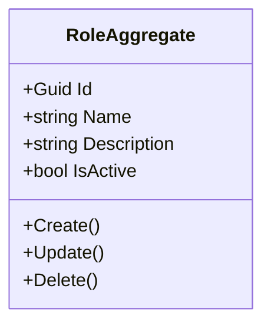
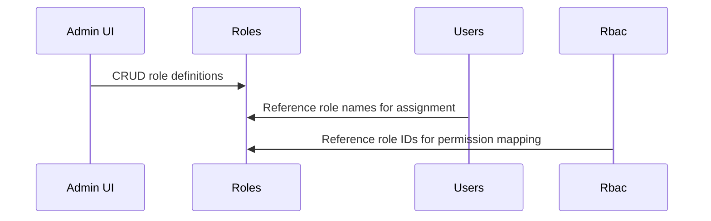

# Roles Microservice

## Overview

The Roles microservice manages the definition of platform roles. A role is a named permission group (e.g., "Admin", "Resident", "Security Guard", "Accountant") with a description explaining its purpose. Roles are assigned to users via the Users microservice and mapped to specific resource permissions via the RBAC microservice. This service is purely a catalog of role definitions -- it does not enforce access control itself.

## Business Context

In a role-based access control system, roles serve as the bridge between users and permissions. Rather than assigning individual permissions to each user (which does not scale), users are assigned roles, and roles are mapped to sets of allowed operations. The Roles microservice provides the canonical list of roles that exist in the platform.

Different platform deployments may need different roles: a property management platform needs "Resident", "Owner", "Security Guard", and "Administrator"; a generic SaaS might need "Viewer", "Editor", and "Admin". By maintaining roles as a separate, manageable catalog, the platform supports customization without code changes.

For a new developer: this is the "job titles" directory. It defines what roles exist (their names and descriptions), but does not determine what each role can do -- that responsibility belongs to RBAC.

## Ubiquitous Language

| Term        | Definition                                                                                                   |
| ----------- | ------------------------------------------------------------------------------------------------------------ |
| Role        | A named permission group that can be assigned to users. Defined by a unique ID, name, and description.       |
| Name        | The human-readable identifier of the role (e.g., "Admin", "Resident", "Vigilante").                          |
| Description | An explanation of what the role is intended for and what level of access it typically grants.                  |
| IsActive    | Whether the role is currently available for assignment to users.                                               |
| Assignment  | The act of giving a user a role, performed in the Users microservice by referencing the role's name.          |
| Permission  | A specific allowed operation (defined in RBAC) that is associated with a role.                                 |
| RBAC        | Role-Based Access Control. The system that maps roles to permissions on resources.                             |
| Soft Delete | Logical removal of a role by marking it inactive without physical deletion.                                    |
| Platform Role | A role that applies across the entire platform rather than being tenant-specific.                            |
| CreatedBy   | The administrator who defined the role.                                                                       |
| Catalog     | The collective set of all defined roles available in the platform.                                             |
| Role Guard  | Domain validation ensuring role names and descriptions are non-empty and IDs are valid.                       |
| RoleCreatedDomainEvent | Event published when a new role is added to the catalog.                                          |
| RoleUpdatedDomainEvent | Event published when a role's name or description changes.                                        |
| RoleDeletedDomainEvent | Event published when a role is soft-deleted.                                                      |

## Domain Model

The Roles domain has a single, straightforward aggregate. The `RoleAggregate` represents a role definition with its name and description. Domain events are emitted on all lifecycle changes.

## Data Dictionary

### RoleAggregate

A role definition in the platform catalog.

| Field       | Type    | Description                                    |
| ----------- | ------- | ---------------------------------------------- |
| Id          | Guid    | Unique identifier of the role                  |
| Name        | string  | Display name (e.g., "Admin", "Resident")       |
| Description | string  | Explanation of the role's purpose              |
| IsActive    | bool    | Whether available for assignment               |
| IsDeleted   | bool    | Soft-delete flag                               |
| CreatedBy   | Guid    | User who created the role                      |
| CreatedAt   | Instant | UTC timestamp of creation                      |
| UpdatedBy   | Guid?   | User who last modified the role                |
| UpdatedAt   | Instant?| UTC timestamp of last modification             |

## Integration Architecture

Roles is a reference catalog consumed by Users (for role assignment) and RBAC (for permission mapping). It does not consume events from other microservices.

## Event Catalog

### Events Produced

| Event                    | Trigger    | Purpose                              |
| ------------------------ | ---------- | ------------------------------------ |
| `RoleCreatedDomainEvent` | `Create()` | New role added to the catalog        |
| `RoleUpdatedDomainEvent` | `Update()` | Role name or description changed     |
| `RoleDeletedDomainEvent` | `Delete()` | Role soft-deleted from the catalog   |

## API Reference

Base path: `/api`

### Roles

| Method | Path              | Description                                | Auth    |
| ------ | ----------------- | ------------------------------------------ | ------- |
| GET    | `/api/Role`       | Paginated list of roles (supports Criteria)| Bearer  |
| GET    | `/api/Role/{id}`  | Get a role by ID                           | Bearer  |
| POST   | `/api/Role`       | Create a new role                          | Bearer  |
| PUT    | `/api/Role/{id}`  | Update a role                              | Bearer  |
| DELETE | `/api/Role/{id}`  | Soft-delete a role                         | Bearer  |

All endpoints return RFC 7807 Problem Details on error. List responses use `Pagination<T>`.

## Key Design Decisions

- **Separation from RBAC:** Roles defines what roles exist; RBAC defines what each role can do. This separation allows roles to be managed independently of permission configuration.

- **Role name as string reference:** Users store role names as strings rather than GUIDs, enabling direct matching with identity provider group names and simplifying display logic.

- **No tenant scoping:** Roles are global platform definitions. All tenants share the same role catalog, ensuring consistent role semantics across the platform.

- **Soft delete for safety:** Deleting a role does not automatically revoke it from users. The role becomes unavailable for new assignments but existing assignments remain until explicitly removed.

- **Minimal domain logic:** Role definitions are intentionally simple (name + description) to keep the service focused and avoid duplicating permission logic that belongs in RBAC.

## Related Microservices

| Microservice | Direction | Integration Point                                                |
| ------------ | --------- | ---------------------------------------------------------------- |
| Users        | Outbound  | References role names when assigning/revoking roles to users     |
| Rbac         | Outbound  | References role IDs when mapping roles to resource permissions    |
| MicrosoftGraph | Outbound | Role names may correspond to AD/CIAM groups                    |
